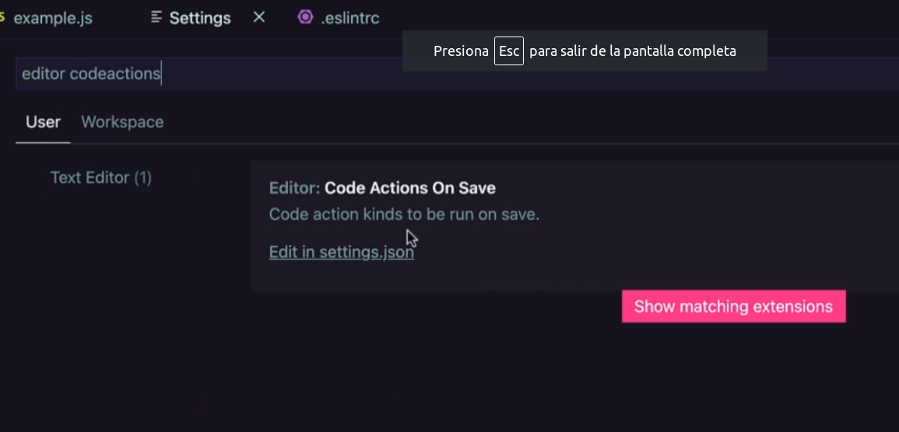
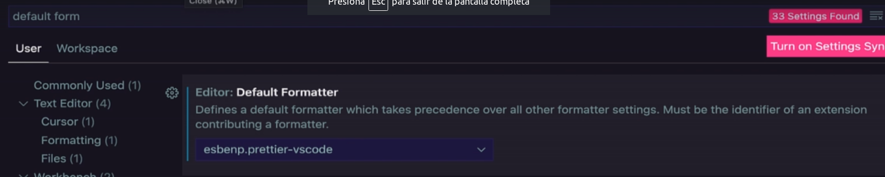

```
eslint --init (o crear .eslintrc)
npx eslint .
```

## Reparar automaticamente

```
npx eslint . --fix
```

## Reparar errores de eslint automaticamente

1. tener instalado la extensión eslint
2. Configurar en settings lo siguiente



```
"editor.codeActionsOnSave": {
    "source.fixAll": true
  },
```

## Instalar la extensión prettier code formatter

2. Configurar en settings lo siguiente
   
